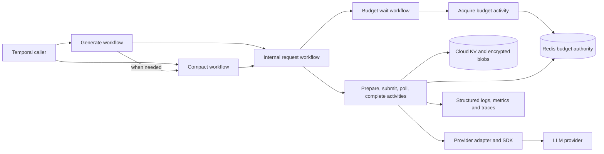

# System Overview

The production worker runs four Temporal workflows and eight activities. The
workflows orchestrate durable steps and timers; activities perform authorization,
cloud storage, Redis accounting and provider I/O. Provider-specific SDK types
stay behind adapters. See the exact names in the
[MVP v1 implementation boundary](../reference/mvp-v1-status.md).

Public workflows return final responses; internal activities can return pending.
No streaming or token-event API is supported in v1.

## Component relationships

## Request lifecycle

1. **Plan compaction.** The main workflow authorizes and inspects inherited
   context. If necessary, it runs the compaction workflow first and uses its
   checkpoint as the parent. Compaction uses the same execution machinery as
   generation and can reuse a compatible cached artifact.
2. **Prepare or recover.** The runtime authorizes the scope, establishes durable
   request identity and pending discovery, and reloads saved progress. Eligible
   successful cache entries can satisfy the request without provider work.
3. **Compile and price.** Snapshot-bound routing and provider compilation select
   an authorized plan before budget acquisition. Estimation produces a
   conservative bound and records the configuration and price provenance.
4. **Acquire once.** One Redis mutation reserves the bound across every matching
   window. If capacity is unavailable, the budget workflow waits using a Temporal
   timer and tries again. An activity does not remain occupied waiting for money.
5. **Claim and submit.** A single-use Redis claim must succeed within 15 minutes
   of acquisition. Synchronous adapters return their HTTP response in this step.
   Resumable adapters persist the provider identifier and return pending.
6. **Poll once per step.** The workflow waits with a timer, then calls
   `llm.poll.v1`. The activity retrieves status once and returns pending, provider
   completion, failure or an unknown outcome. Provider identifiers remain in
   durable storage; the workflow carries an internal request reference.
7. **Complete.** Immutable encrypted artifacts and conditional cloud records
   publish the result and checkpoint. Redis settlement and cache publication
   resume idempotently after interruption. There is no cross-store transaction.
8. **Retry with explicit accounting.** Replaying an activity recovers its existing
   attempt. An uncertain paid submission or a retryable provider failure takes
   the explicit acquisition path before a replacement attempt. Unknown paid
   work keeps its original charge and pending record.

Application tool calls are returned as model output. The worker does not execute
them. There is no service cancellation API; disconnected workflow contexts and
abandoned child-close policies prevent a canceled caller from canceling paid
work. Administrative termination is still possible, so pending discovery is
retained independently of workflow history.

See [workflow behavior](../reference/internal-workflows.md),
[cloud execution](../reference/cloud-provider-execution.md) and
[finalization](../reference/cloud-request-repository.md) for detailed contracts.

## Runtime composition and snapshots

`NewCloudV1RuntimeBuilder` constructs bounded execution and generation planning
from one immutable configuration snapshot. The normal durable CLI installs it
only with explicit trusted-Temporal authorization and valid cloud/Redis settings.
Missing capabilities fail closed before polling. The older reusable
`Engine.Generate` and direct phase builders are not substitutes for this runtime.

Each activity step holds a snapshot lease until it finishes. Reload validates a
replacement snapshot before swapping it in; old clients remain alive while
existing calls use them. Cloud identity, Redis identity and configuration digest
are checked together. Query has its own authorization and reader composition;
missing query capabilities return typed failures rather than inferred answers.

## Failure domains

| Domain | Behavior |
| --- | --- |
| Invalid or unauthorized input | Rejected before provider submission |
| Insufficient budget | Wait result; Temporal timer and another bounded acquisition |
| Redis unavailable or authority marker missing | Paid admission fails closed; no automatic accounting reconstruction |
| Cloud state unavailable | Required durable steps fail closed and replay their saved state on retry |
| Retryable provider failure | Settle the old attempt, then acquire a distinct replacement attempt |
| Unknown provider outcome | Retain the old charge and pending record; acquire new budget for retry |
| Worker termination | Temporal retries reload durable progress instead of blindly resubmitting |
| Invalid configuration reload | Preserve the active snapshot; readiness follows its dependency checks |

## Horizontal scaling

Replicas share cloud request/checkpoint/cache storage and Redis budget authority.
Atomic Redis mutations coordinate admission. When enabled, budget mutations also
append Stream hints atomically; a background consumer is not automatically
started by the runtime. Stream hints do not authorize spending or reconstruct a
lost accounting dataset. Provider clients are snapshot-local; no pod affinity is
required for durable requests.

Memory and Redis-only legacy compositions are development fixtures. Production
qualification still needs separate live provider, cloud and restore evidence;
checked-in workflow registration is not proof of a deployed service.
